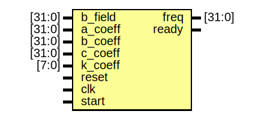
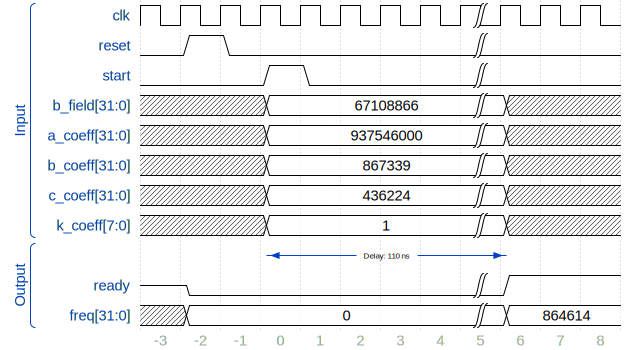

# F(B) calculator

- **File**: b_to_f.sv
- **Brief:** Calculation of F by using formula: F(b)=k*(a*B)/(sqrt(b+c*B^2))
## Diagram

## Description

 
 

 Pipeline: 11 - clock cycles. 

 Work cyclogramma (B[T]=0.2 NICA-Buster example):
 
 

## Ports

| Port name | Direction | Type   | Description                                                           |
| --------- | --------- | ------ | --------------------------------------------------------------------- |
| b_field   | input     | [31:0] | значение магнитного поля: максимальное значение 128 T, квант ~29.8 нТ |
| a_coeff   | input     | [31:0] | a - коэффициент формулы                                               |
| b_coeff   | input     | [31:0] | b - коэффициент формулы                                               |
| c_coeff   | input     | [31:0] | c - коэффициент формулы                                               |
| k_coeff   | input     | [7:0]  | Номер рабочей гармоники ВЧ                                            |
| reset     | input     |        | сброс в значение по умолчанию                                         |
| clk       | input     |        | тактовый сигнал                                                       |
| start     | input     |        | запуск подсчета                                                       |
| freq      | output    | [31:0] | реузьлтат подсчета частоты: Freq[Hz]*(2^32)/(F_clk)                   |
| ready     | output    |        | сигнал готовностси значения частоты                                   |
## Signals

| Name          | Type            | Description                                                  |
| ------------- | --------------- | ------------------------------------------------------------ |
| numerator     | reg[63:0]       | числитель                                                    |
| denominator   | reg[63:0]       | знаменатель                                                  |
| quotient      | reg[63:0]       | результат деления                                            |
| radical       | reg[127:0]      | исходные данные для взятия квадратного корня                 |
| sqrt_result   | reg[63:0]       | результат взятия квадратного корня                           |
| b_f           | reg[31:0]       |                                                              |
| a_c           | reg[31:0]       |                                                              |
| b_c           | reg[31:0]       |                                                              |
| c_c           | reg[31:0]       |                                                              |
| k_c           | reg[31:0]       |                                                              |
| process_state | reg[7:0]        | отслеживание конвеера подсчета                               |
| active        | reg             | состояние работы: 1 - процесс подсчета, 0 - ожидание запуска |
| mult_a        | reg[1:0][63:0]  | переменные для общего использования умножителя               |
| mult_b        | reg[1:0][63:0]  |                                                              |
| mult_q        | reg[1:0][127:0] |                                                              |
## Processes
- unnamed: ( @(posedge clk, posedge reset) )
  - **Type:** always
  - **Description**
  calculate process
 
## Instantiations

- sqrt_int_64_0: sqrt_int_64
  - **Description**
  64-bit sqrt with 1-clk pipeline

- divide_32_0: divide_32
  - **Description**
  32-bits divider with 1-clk pipeline

